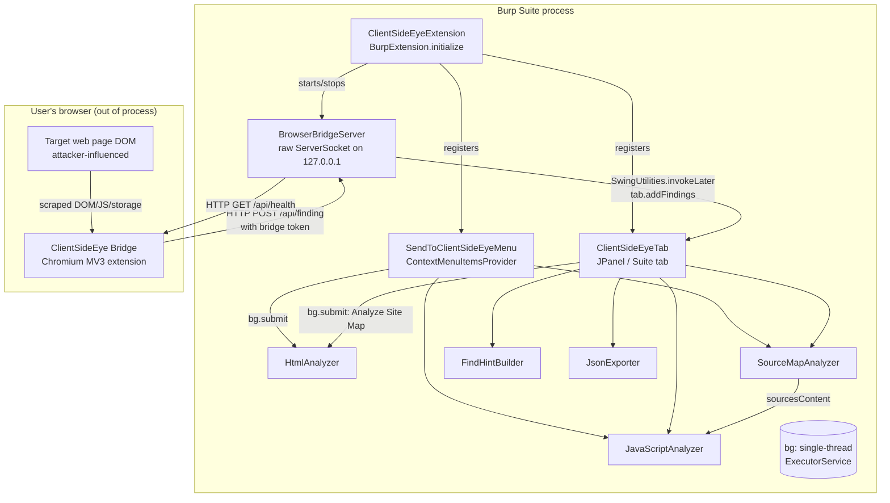

# ClientSideEye — Architecture Map

Reviewed at commit `99c003b` (branch `main`), Gradle 9.4.0, Java 17 toolchain, Montoya API
`2025.12` (compile-only).

## 1. API model

ClientSideEye uses **only the Montoya API** (`burp.api.montoya.*`). There is no use of the
legacy Extender API and no deprecated Burp API calls were found. `BurpExtension.initialize`
is the single entry point (`ClientSideEyeExtension`).

## 2. Component overview

## 3. Data flow: HTTP message → reported finding

Two independent ingestion paths feed the same in-memory finding store
(`ClientSideEyeTab.findingsByKey`):

1. **Passive, Burp-sourced path** (no new network traffic generated):
   - User clicks **Analyze Site Map (in-scope)**, or right-clicks **Send to ClientSideEye**
     from Proxy/Target/Repeater/Logger.
   - `api.siteMap().requestResponses()` or `ContextMenuEvent.selectedRequestResponses()`
     supplies already-captured `HttpRequestResponse` objects — Burp has already made the
     request; ClientSideEye only reads the stored response body.
   - `HtmlAnalyzer` / `JavaScriptAnalyzer` / `SourceMapAnalyzer` run pure, static, in-memory
     string/DOM analysis (jsoup + regex) and return `List<Finding>`.
   - Findings are merged into `findingsByKey` (deduplicated by `Finding.stableKey()`) and the
     table is refreshed.
   - This entire path runs on the extension's own single-thread background executor (`bg`),
     never on the Swing Event Dispatch Thread (EDT) and never on a Burp callback thread.

2. **Active, browser-sourced path** (via the companion Browser Bridge):
   - A separate, optional Chromium MV3 extension (`browser-extension/clientsideeye-bridge/`)
     scrapes the *rendered* DOM, `localStorage`/`sessionStorage`, inline scripts, and
     `performance` resource entries of the page the user is actively viewing.
   - It POSTs each finding as `application/x-www-form-urlencoded` to
     `http://127.0.0.1:<port>/api/finding`, authenticated with a per-session bearer-style token
     (`X-ClientSideEye-Token`) that `BrowserBridgeServer` generates at startup and displays in
     the Burp UI/output.
   - `BrowserBridgeServer` (a hand-rolled HTTP/1.1 server, not Burp's HTTP stack, since it is
     accepting *inbound* local connections rather than issuing outbound requests) parses the
     request, validates the token, builds a `Finding` directly from POST parameters, and calls
     `tab.addFindings(...)`.
   - This is the one path where **displayed finding fields (title/url/evidence) can be
     verbatim, attacker-controlled web-page content** rather than something ClientSideEye
     derived itself from static analysis — see `SECURITY_REVIEW.md`.

Both paths converge on `ClientSideEyeTab.addFindings(List<Finding>)`, which always dispatches
its mutation of `findingsByKey` via `SwingUtilities.invokeLater` regardless of caller thread.

## 4. Trust boundaries

| Boundary | Description |
|---|---|
| Target application → Burp | Standard Burp boundary; response bodies are treated as untrusted throughout (jsoup parsing, bounded regex, size-limited snippets). |
| Target application (rendered DOM) → Browser Bridge extension → `BrowserBridgeServer` | **New** trust boundary introduced by this extension. A malicious page cannot itself talk to the bridge (it doesn't know the token and the bridge only grants CORS to `chrome-extension://`/`moz-extension://`/`safari-web-extension://` origins), but the *content* the legitimate bridge extension scrapes from the page **is** attacker-controlled and flows into `Finding` fields that are later rendered in Swing UI components. |
| Local machine (any process) → `BrowserBridgeServer` listening on `127.0.0.1` | Any local process that can read the displayed/logged token (or guess/brute force it — 24 random bytes, so not practically guessable) can submit findings. This is an accepted, disclosed design trade-off for a localhost-only developer tool, not a remote attack surface. |
| ClientSideEye extension → Burp Suite Swing UI | Finding data (some of it attacker-influenced) is rendered in `JTable`/`JComboBox` cells and copied to the clipboard/exported to JSON/written to files chosen by the user. |

## 5. Threading model

- `ClientSideEyeExtension` creates one daemon single-thread `ExecutorService` (`bg`) for all
  background work (right-click analysis, Site Map scans, JSON export).
- `BrowserBridgeServer` uses two executors: a single-thread accept-loop executor and a cached
  thread pool for per-connection handling (each accepted socket gets its own worker thread with
  a 5 s read timeout).
- All Swing UI mutations happen either directly on the EDT (button/menu listeners are already
  on the EDT) or are explicitly marshaled to the EDT via `SwingUtilities.invokeLater` /
  `invokeAndWait` from background threads (`addFindings`, `setBridgeConnectionInfo`,
  `confirmLargeSiteMapScan`).
- `api.extension().registerUnloadingHandler(...)` stops the bridge server and calls
  `bg.shutdownNow()`.

## 6. Persistence model

ClientSideEye has **no built-in persistence** across Burp project save/reload — all findings
live in an in-memory `LinkedHashMap` (`findingsByKey`, capped at `MAX_FINDINGS = 5000` with
FIFO eviction) for the lifetime of the loaded extension. The only durable output is the
user-triggered **Export JSON…** file write (`JsonExporter` → `Files.writeString`) to a
user-chosen path via `JFileChooser`. There is no use of
`Persistence.temporaryFileContext()`/`Persistence.extensionData()` and no project-file
integration. HTTP request/response objects themselves are never retained beyond the scope of a
single analysis call (only extracted strings — URL, host, an evidence snippet up to a few
hundred characters — are stored per finding), which is a good practice for large-project memory
behavior.

## 7. Network behavior

- **Outbound:** ClientSideEye issues **no outbound HTTP requests of its own**. All HTTP data it
  analyzes was already fetched by Burp (Site Map / Proxy history / Repeater / Logger) via
  Burp's own networking stack. No `java.net.URL`, `HttpURLConnection`, `HttpClient`, OkHttp, or
  Apache HttpClient usage exists anywhere in `src/main`.
- **Inbound (new):** `BrowserBridgeServer` binds a plain `java.net.ServerSocket` to
  `127.0.0.1` (default port `17373`, falling back through `17374`–`17382` if busy) to receive
  POSTed findings from the optional companion browser extension. This is a deliberate, disclosed
  design choice (documented in `README.md`), not a Burp networking API call, because Burp's
  Montoya API has no supported way to *host* an inbound HTTP listener — only to *issue*
  outbound requests via `Http.issueHttpRequest()`. This is the correct and only remaining
  approach.

## 8. Burp API integration points

- `BurpExtension.initialize(MontoyaApi)` — entry point.
- `api.extension().setName(...)`, `registerUnloadingHandler(...)`.
- `api.userInterface().registerSuiteTab(...)`, `registerContextMenuItemsProvider(...)`,
  `createRawEditor()`, `swingUtils().suiteFrame()`.
- `api.siteMap().requestResponses()`.
- `api.logging().logToOutput(...)/logToError(...)`.
- `HttpRequestResponse`, `HttpRequest.isInScope()/url()`, `HttpResponse.bodyToString()`.
- No scanner check (`ScanCheck`), no HTTP handler (`HttpHandler`/`ProxyHttpRequestHandler`), no
  session-handling action, and no AI (`burp.api.montoya.ai`) integration exist in this
  extension.
